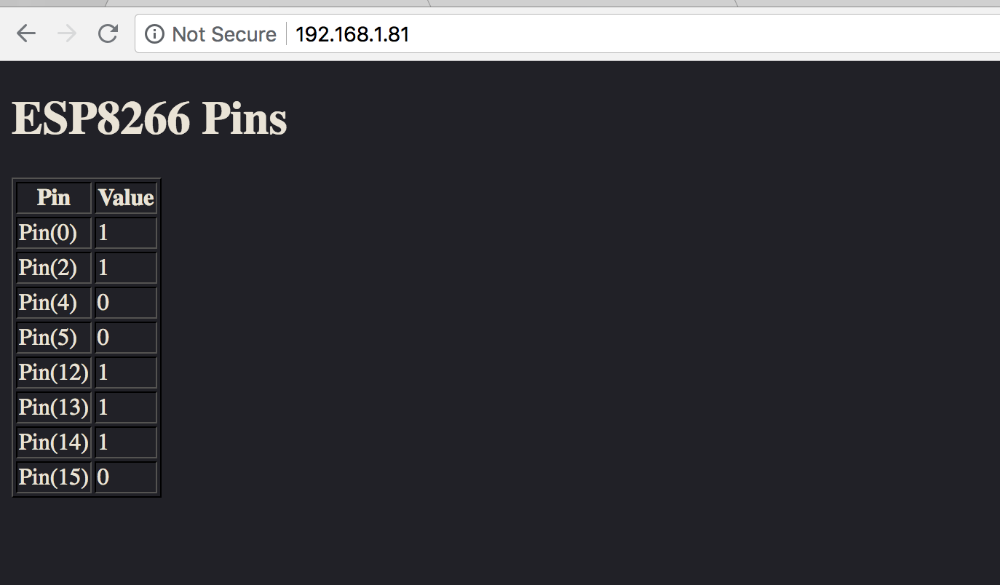

### Simple HTTP Server with MicroPython

You can connect to this server by ip address and it shows the status of ESP8266 pins.

```bash
pip install esptool

esptool.py --port /dev/cu.wchusbserial1420 erase_flash  

wget http://micropython.org/resources/firmware/esp8266-20180511-v1.9.4.bin

esptool.py --port /dev/cu.wchusbserial1420 --baud 115200 write_flash -fm dio 0x00000  /Development/MicroPython/firmware/esp8266-20180511-v1.9.4.bin

export AMPY_PORT=/dev/cu.wchusbserial1420
export AMPY_BAUD=115200
export AMPY_DELAY=1

ampy put boot.py
ampy put main.py

```

To get the IP address connect to serial screen first:
screen /dev/cu.wchusbserial1420 115200

Example output:

